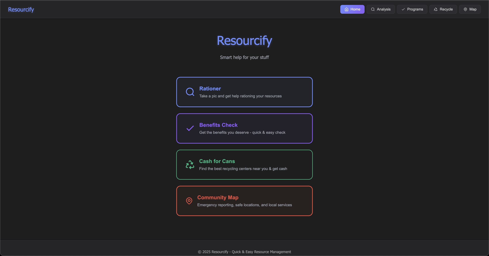
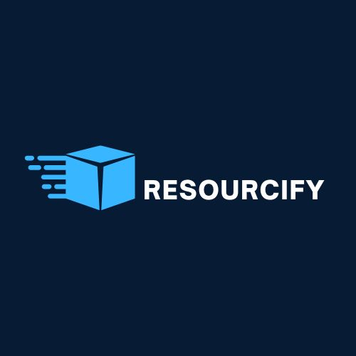

# Resourcify – Smart Resource Management with AI

### Big Data Hackathon 2025  
**Team 114 – Psyche**

#### Team Coordinator GitHub Username: dhruvbantval

**Members:** Dhruv Bantval, Rishi Kumar, Chenhao Zhang, Saevin Hong  

**Built With:** React 19 + Vite & Node.js + Express.js

---

## What Is Resourcify?

Resourcify is a simple, supportive web app designed to help individuals and families keep track of their essential supplies.  
By taking a photo of the items they have, users receive clear guidance on what those items are, how they fit into daily needs, and what they might consider adding to stay prepared and secure.

The goal is to offer clarity and confidence to people who may be facing housing instability, major financial strain, or unexpected life changes.

---

## Visual

---

# Resourcify - AI Resource Manager

---

## What the App Does

Resourcify focuses on making resource management easy and accessible:

- Photo-based item recognition for quick inventory.
- Automatic sorting into categories such as food, hygiene, safety, tools, and shelter-related items.  
- Clear suggestions to help users understand what they have and what may be useful to add.  
- Optional budget planning that recommends affordable, prioritized items.  
- A simple community map highlighting nearby helpful locations.  
- Works on any device and can be added to a home screen for quick access.

---

## Why This Helps

Many people experiencing sudden changes in their living situation may not know:

- Exactly what supplies they currently have  
- Which items are most important to stay safe and prepared  
- How to plan ahead on a limited budget  
- Where nearby supportive resources are located  

Resourcify removes uncertainty by turning a single photo into clear, organized, and practical guidance.

---

## How People Use It

- Tracking personal essentials  
- Understanding what items may be important to add  
- Building basic safety or comfort kits  
- Planning purchases with a limited budget  
- Finding nearby helpful locations or donation centers  

---

## Basic Technology

- **React 18 + Vite** for the user interface  
- **Node.js + Express.js** for the backend  
- **Multur + Morgan** for the middleware
- **AI Vision + Google Maps API** for photo & location understanding  

---

## Future Possibilities

- Voice-based item input  
- Multi-language support  
- Optional reminders for resupplying  
- Shared resource lists for families or small groups  
- More detailed community resource mapping  

---

## Our Goal

Resourcify aims to be a simple, supportive guide that helps users stay organized, informed, and prepared— especially during challenging or uncertain times.  
It is built to be simple enough for anyone to use while offering meaningful, practical assistance.
